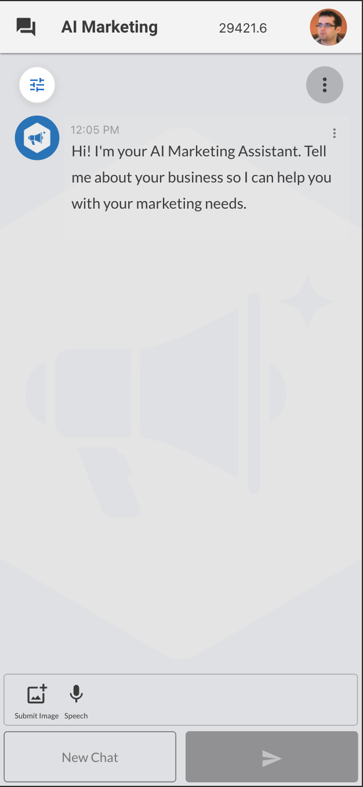
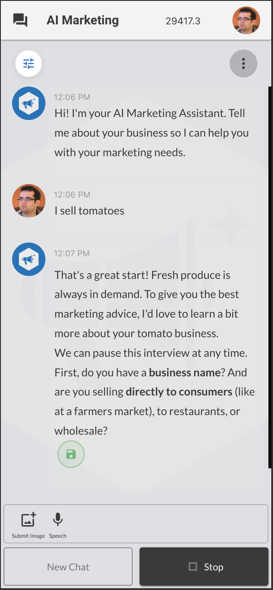
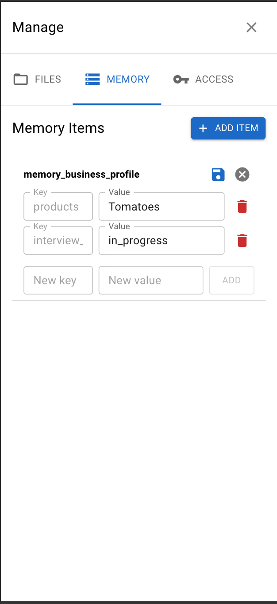
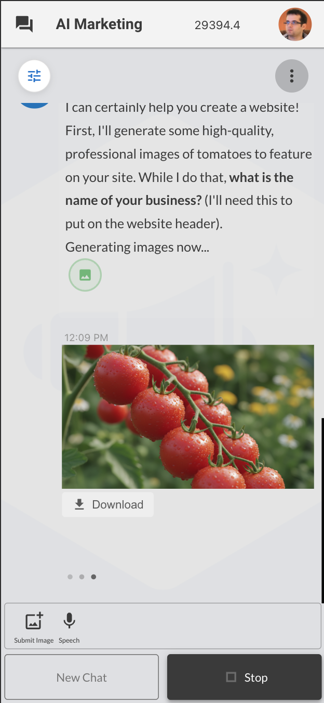
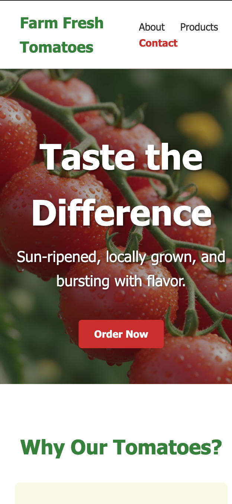

# AI Marketing Assistant

<table>
  <tr>
    <td>
      
    </td>
    <td>
      <strong>Open-source AI-powered marketing assistant for automated content creation, campaign management, and lead generation. Create stunning marketing images, videos, landing pages, and email campaigns with AI.</strong>
    </td>
  </tr>
</table>

<br />

<div style="display: flex; flex-direction: row;">
    
    
    
    
    
    
</div>

## Installation

```bash
npm install -g openkbs
openkbs login
git clone git@github.com:open-kbs/ai-marketing.git
cd ai-marketing
openkbs push
```

## Features

- **AI Image Generation** - Create marketing visuals with Gemini and GPT-4
- **AI Video Creation** - Generate video content with Sora 2
- **Landing Page Builder** - Build and publish pages instantly
- **Email Marketing** - Send targeted campaigns
- **Business Profiling** - AI interviews to understand your brand
- **Task Automation** - Schedule posts and reminders
- **Multi-language** - Adapts to any language automatically
- **White-label Ready** - Customize for any business or market

## License

MIT
